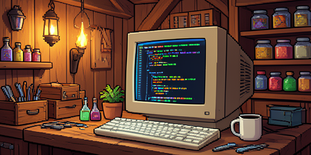

# Necesse Headless Harness



A headless integration test harness for Necesse mods. It drives a real dedicated server from
plain-text scenario files — placing objects, filling containers, opening UIs, clicking slots,
asserting what happened — with **no rendering and nobody playing the game**.

> **Alpha, and unannounced on purpose.** The API will change. It is being built against one real
> mod first, because the only way to find out whether an API is right is to use it for something
> that matters. If you found this before it was announced, it works, but do not expect stability.

## Letting time pass

`harness query tick` reports the server tick count for the level under test, and the Python client's
`settle(ticks)` waits for it to advance.

This is the difference between testing what a piece of code computes and testing what a system does. Without
it a consumer mod can only invoke its own work directly, one command at a time, which verifies arithmetic and
steps over scheduling: timers, cooldowns, queues and cascades are all invisible. The first bug it found in a
consumer was two devices moving the same items back and forth forever while every single-shot test passed --
and, worse, while the observable totals looked settled.

Waiting is the client's job on purpose. A `settle` verb that slept until the count advanced would deadlock:
verbs run on the server thread, so a verb waiting for a tick waits for itself. The counter is exposed and
polled instead.

Counted per level, not globally: `Level.serverTick` runs once per loaded level per server tick, so a global
count runs at a multiple of the real rate the moment a second level loads and "wait sixty ticks" silently
waits for twenty. The level watched is the one the harness's player is on.

## Why this exists

A mod's pure logic is easy to unit test and rarely where the bugs are. The bugs are in how it
behaves *inside a running game*: objects on a real level, containers opened by a real player,
state surviving a real save and reload. That is normally checked by hand, which does not scale and
does not get repeated — so it stops happening, and regressions land.

This makes those checks scriptable and repeatable, which also happens to suit development with an
AI coding agent: an agent can run the suite and read the failures itself, instead of asking you to
go and look.

## What a scenario looks like

```
harness clear 8
harness place storagebox 3 0
harness fill 3 0 ironbar 25
harness expect item 3 0 ironbar 25

harness player spawn
harness give ironbar 10
harness open 3 0
harness quickstack
harness expect held ironbar 0
harness expect item 3 0 ironbar 35
harness expect total ironbar 35
harness player despawn
```

Every line is a server console command, so any prefix of a scenario can be pasted into a live
server to debug a failure by hand. That is deliberate: the format is data, not code.

Note what that example does *not* mention: this mod. It places a vanilla chest and quick-stacks
into it. **The harness can drive a mod whose source you do not have**, because the verbs address
everything by string ID.

## The player is not a person

`player spawn` connects a client with no socket. `NetworkInfo` is a four-method abstract class and
the game already ships `InvalidNetworkInfo`, whose `send` discards its bytes, so a socketless
client is a state the engine supports rather than a hole punched in it — `OneWorldMigration`
builds one during save migration, and singleplayer's local client legitimately has one too.

This matters because half of what mods add is containers, and a container is built from a player's
inventory. Without it, every container test needs a human.

## Install

The harness is a **normal installed mod**, not something you copy into your source, and not a dev mod.

```bash
make install        # builds and copies the jar into ~/.config/Necesse/mods/
```

It has to be installed rather than dev-loaded because the game accepts exactly **one** dev mod:
`DevModProvider.devMod` is a single String, and `LoadedDevMod.validateDevFolderAndReturnJar`
rejects a dev folder holding more than one file. Your mod keeps that slot. `DesktopPlatform`
registers `ModsFolderModProvider` on dedicated servers as well as clients, so both load together.

Being a separate mod also means the `Level.serverTick` patch that makes any of this safe lives in
one place. It binds to an exact method signature and will break on a game update — once, here,
rather than in every mod that copied it. And nothing test-related ends up in your shipped jar.

## Run

```bash
# prove the harness works in your install, before blaming your own mod
tools/run_scenario.sh tests/scenarios/selfcheck.txt

# your mod
MOD_UNDER_TEST=/path/to/yourmod/build/jar \
   tools/run_scenario.sh /path/to/yourmod/tests/scenarios/*.txt
```

Environment: `MOD_UNDER_TEST` (dev mod's jar directory; empty runs the harness alone),
`SCENARIO_DIR` (where `run <name>` looks; defaults to the first scenario's directory),
`HARNESS_WORLD` (must contain `harness`, since a fresh run deletes it), `HARNESS_DEADLINE`,
`NECESSE_GAME_DIR`.

**A run cannot hang.** A deadlock does not stop Necesse: `ThreadFreezeMonitor` writes a crash log
and leaves the JVM alive with its command thread no longer reading stdin. The runner therefore
bounds itself, checks the server is alive between commands, bounds the stop, and prints any crash
log the game wrote during the run. Before that was true, a deadlock looked like a test run that
took as long as whatever timeout happened to wrap it.

## Verbs

Generic, because they can be said without knowing your mod:

| Verb | Meaning |
|---|---|
| `place <object> <dx> <dy>` | by object string ID, or an alias you registered |
| `break <dx> <dy>` | remove it |
| `fill <dx> <dy> <item> <n>` | into whatever holds an inventory there |
| `clear <radius> [tile]` | flatten an area around spawn |
| `give <item> <n>` | into the player's inventory |
| `open <dx> <dy>` | `GameObject.interact`, the same door a player uses |
| `close` | close the open container |
| `click <slot> <ACTION>` | a raw `ContainerAction` |
| `quickstack` / `restock` | the engine's own slot conventions, so they work on vanilla chests |
| `expect item\|total\|held` | assertions |
| `player spawn\|despawn` | the socketless client |
| `run <name>` / `echo <text>` | compose and annotate |

Coordinates are **relative to the world spawn tile**, so scenarios do not depend on the seed.

## Adding your own verbs

```java
public void postInit() {
   Harness.registerObjectAlias("unit", "mymodstorageunit");
   Harness.registerExpectation(new MyCapacityExpectation());   // expect capacity <dx> <dy> <n>
   Harness.registerVerb(new MyBenchmarkVerb());                // a whole new verb
}
```

Registering over something the harness ships is allowed and intended. The built-in `expect item`
counts one tile's inventory, which is right for a chest and wrong for anything that aggregates
across containers — so a mod must be able to redefine the word rather than invent a second one
meaning the same thing.

**Your harness-facing classes must not be in your released jar.** This is the one thing to get
right, and a `try/catch` will not save you.

`LoadedMod.loadClasses` defines **every** class in a mod jar as the mod loads, and turns a
`LinkageError` or `ClassNotFoundException` into a fatal `ModLoadException`. So a single class
referencing a harness type is enough to make your mod refuse to load for anyone who has not
installed the harness -- and it fails during mod loading, before any of your code runs, so there is
no call site left to guard. The symptom misleads too: the loader then dies with a
`NullPointerException` about a null dispose method.

The fix is that test code should not ship anyway. Build two jars:

```groovy
tasks.named('buildModJar') { exclude "yourmod/harness/**" }   // released
tasks.register('buildTestModJar', Jar) { ... }                // build/testjar, includes them
```

and point `MOD_UNDER_TEST` at the test one. `optionalDependencies` in `mod.info` is still worth
declaring, so load order is right when the harness *is* present, and a `try/catch (Throwable)`
around your own registration call is still worth having -- with the classes excluded that is the
path actually taken, and `NoClassDefFoundError` is an `Error` which `catch (Exception)` misses.

Verified both ways, by booting a dedicated server with the harness removed from the mods folder:
shipping the classes is fatal, excluding them loads cleanly and logs one line saying the verbs were
not registered.

## Driving it from Python, with pytest

The scenario format is a one-way pipe: a line goes in, and output has to be recognised in a game
log. That is enough for regression scenarios and not enough for a test framework, which needs to
know *which* reply belongs to *which* command, and needs values rather than verdicts. So the harness
also speaks a correlated request/reply protocol:

```
harness rpc 7 query capacity 4 0
```

writes one JSON line to the file named by `-Dnecesseheadlessharness.rpc`:

```json
{"id":"7","ok":true,"verb":"query","lines":[],"checks":[],"data":{"used":1,"total":80}}
```

`rpc` is a decorator around the normal command path, so every verb -- built-in or registered by a
consumer -- works through it without knowing. `hello` reports the protocol version and the whole
vocabulary. `query` returns the value that `expect` would have compared, computed by the same code,
so the two cannot drift.

```bash
make venv     # .venv with the client installed editable
make pytest
```

```python
def test_a_chest_holds_what_you_put_in_it(harness):
    harness.place("storagebox", 2, 0)
    harness.fill(2, 0, "ironbar", 40)
    assert harness.item_at(2, 0, "ironbar") == 40
```

The `harness` fixture gives each test a cleared area and a fresh player; `harness_server` boots one
JVM for the session, because that is the only expensive part. A consumer overrides `harness_config`
to point at its own jar and adds its own fixtures -- the same split as in Java, where the consumer
registers its own verbs.

Scenario files are not going away. They are the artifact you can paste into a live server to watch a
failure happen, and `Harness.as_scenario()` prints the lines a Python test sent for exactly that
reason.

## There is no CI, and there cannot be

Building needs `Necesse.jar` from a licensed install; running needs `Server.jar` and a real world.
No hosted runner can do either. So there is no badge, and there will not be one — verification is
local by nature, and the convention here is to say what you actually ran.

## Licence

MIT. See `LICENSE`. Necesse itself is proprietary and none of it is redistributed here.
